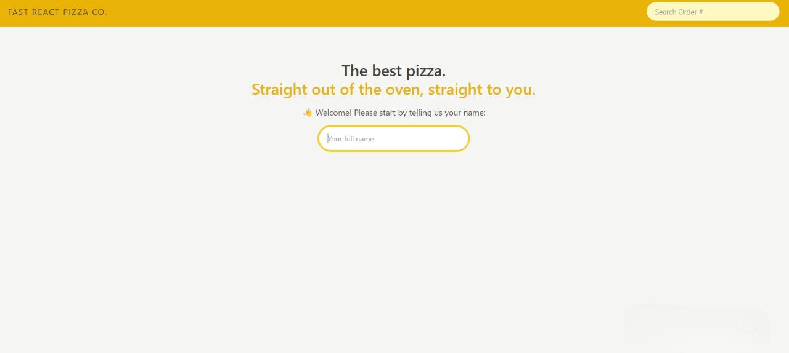
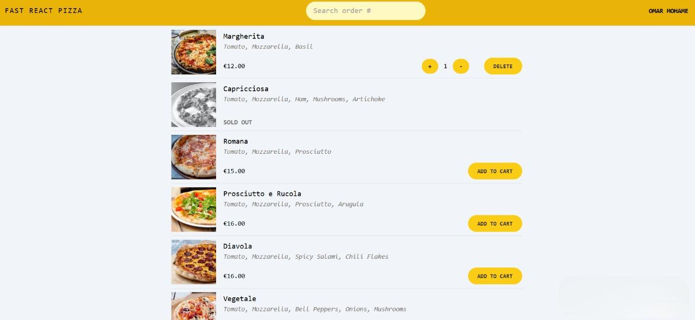
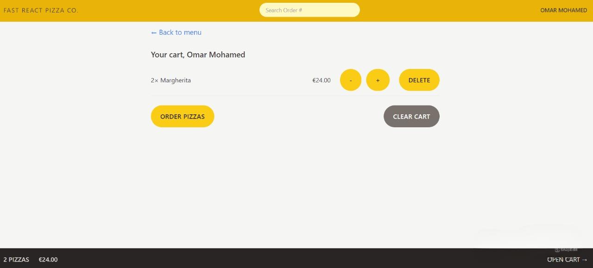
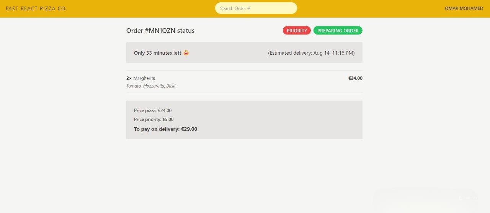

# Fast React Pizza

Fast React Pizza is a web application that allows users to order their favorite pizzas online. It offers a seamless user experience with features like login, pizza selection, quantity adjustment, and an order summary with billing details.

## Table of Contents

- [Features](#features)
- [Tech Stack](#tech-stack)
- [Usage](#usage)
- [Screenshots](#screenshots)
- [Folder Structure](#folder-structure)
- [Contact](#contact)

## Features

- **User Authentication**: Log in with a username to start ordering.
- **Pizza Search**: Search and browse through a variety of pizzas.
- **Order Customization**: Select pizza quantities and view a detailed bill.
- **Responsive Design**: Fully responsive layout for various devices.

## Tech Stack

- **Frontend**: ReactJS, Tailwind CSS
- **State Management**: Redux Toolkit
- **Routing**: React Router

## Usage

- **Login**: Enter your name to log in.
- **Browse Pizzas**: Use the search bar to find your favorite pizzas.
- **Customize Order**: Select the desired quantity of each pizza.
- **View Bill**: The order summary will display the total cost.

## Screenshots

Here are some screenshots of the Fast React Pizza application:

*Login Page*

*Pizza Selection*

*Order Summary*

*bill*

## Folder Structure

- **components/**: Reusable UI components.
- **features/**: Redux slices and business logic.
- **pages/**: Different pages of the application.
- **styles/**: Tailwind CSS configuration and custom styles.

## Contact

If you have any questions or feedback, feel free to reach out:

- **Email**: omarmohamed827@gmail.com
- **LinkedIn**: [Omar Mohamed](https://www.linkedin.com/in/omar-mohamed-611773292)

